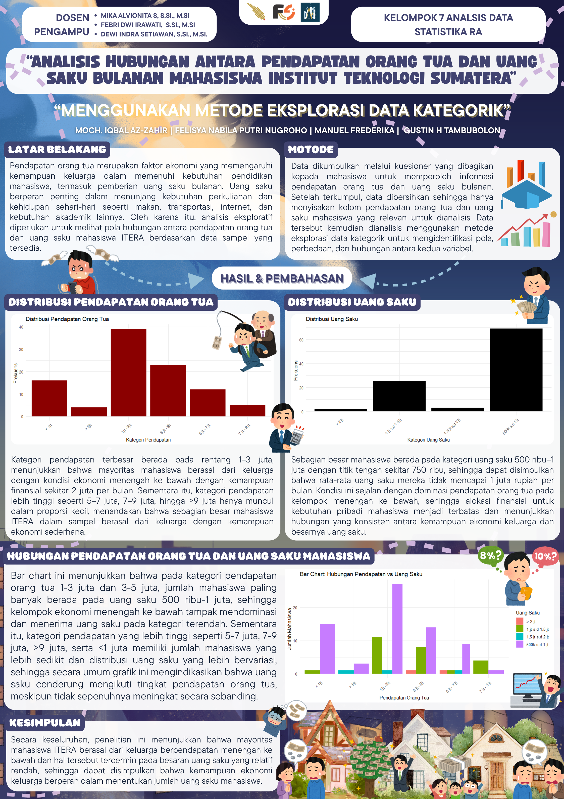
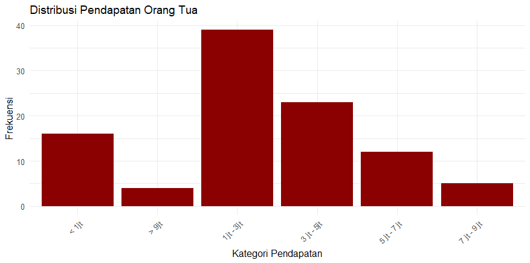
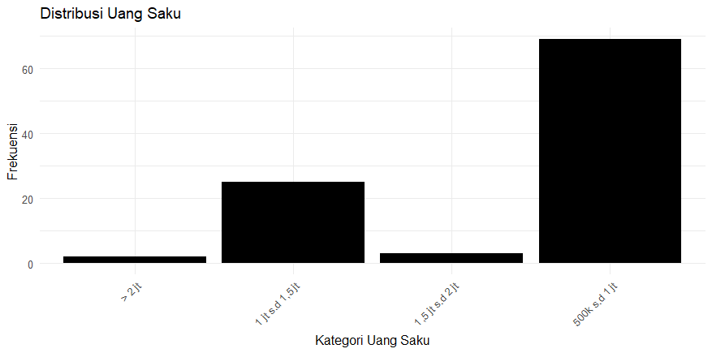
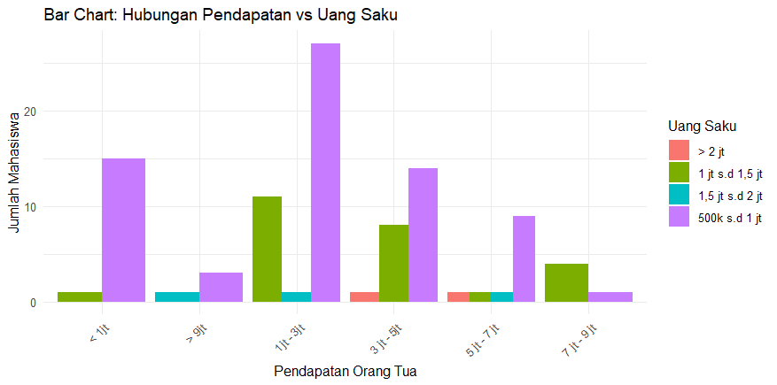

# Tugas Besar Analisis Data Statistika 2025

## “Analisis Hubungan antara Pendapatan Orang Tua dan Uang Saku Bulanan Mahasiswa Institut Teknologi Sumatera”

### Kelompok 7 – Kelas RA

 
<strong>Anggota Kelompok 7</strong>

1. Manuel Frederik – 124450039  
2. Moch. Iqbal Az-Zahir – 124450052  
3. Gustin H. Tampubolon - 124450068  
3. Felisya Nabila Putri Nugroho – 124450104  

Pendapatan orang tua dan uang saku mahasiswa merupakan dua aspek yang berkaitan erat dengan kondisi ekonomi mahasiswa selama menempuh pendidikan. Variasi pendapatan keluarga dapat memengaruhi jumlah uang saku yang diterima mahasiswa untuk memenuhi kebutuhan sehari-hari seperti makan, transportasi, dan keperluan akademik. Melalui analisis data yang dikumpulkan dari mahasiswa ITERA, penelitian ini bertujuan menggambarkan pola distribusi kedua variabel tersebut serta melihat bagaimana keduanya saling berhubungan dalam konteks kehidupan mahasiswa di kampus.

<strong>Tujuan</strong>

1. Mendeskripsikan distribusi pendapatan orang tua mahasiswa ITERA  
2. Menganalisis distribusi uang saku bulanan mahasiswa  
3. Mengkaji hubungan antara pendapatan orang tua dan jumlah uang saku mahasiswa  
4. Memberikan gambaran kondisi ekonomi mahasiswa ITERA secara umum  

## Cara Menjalankan Script
<pre>
1. Pastikan R dan RStudio sudah terpasang di komputer.
2. Clone repository ini atau unduh ZIP lalu buka folder project di RStudio.
3. Pastikan file dataset berada di folder dataset/. Sesuaikan path berikut dengan file yang kalian gunakan:
4. Install paket yang dibutuhkan
5. Buka file codeR_7_RA.Rmd

Note: 
Perhatikan bahwa path pada bagian pembacaan dataset perlu disesuaikan dengan nama file dataset yang kalian gunakan masing-masing.
[ # 2. Baca Dataset ] <-- tepatnya dibagian ini.
</pre>

## Paket R yang Digunakan
<pre>
- readxl <- membaca file Excel (.xlsx)  
- dplyr <- manipulasi dan pembersihan data  
- ggplot2 <- membuat grafik (bar chart, dll.)  
(semua dapat diinstall lewat `install.packages()`)
</pre>

## Penjelasan Singkat Dataset
<pre>
- Sumber: survei kuesioner mahasiswa ITERA (link form digunakan saat pengumpulan)  
- Variabel:  
  - `Pendapatan` <- kategori pendapatan orang tua (rentang bulanan)  
  - `UangSaku` <- kategori uang saku bulanan mahasiswa  
- Dataset dibersihkan sehingga hanya menyisakan kolom yang relevan untuk analisis kategorik
</pre>

## Struktur Repository  
<pre>
Tugas-Besar-ADS-2025-Kelompok-7-RA/
- README.md
- code/
  - codeR_7_RA.Rmd
- poster/
  - Poster_7_RA.png
  - Poster_7_RA.pdf
- data/
  - Data ADS TB Kelompok 7.xlsx
- output/
  - grafik_uangsaku.png
  - grafik_pendapatan.png
  - barchart_hubungan.png
</pre>

### Output

